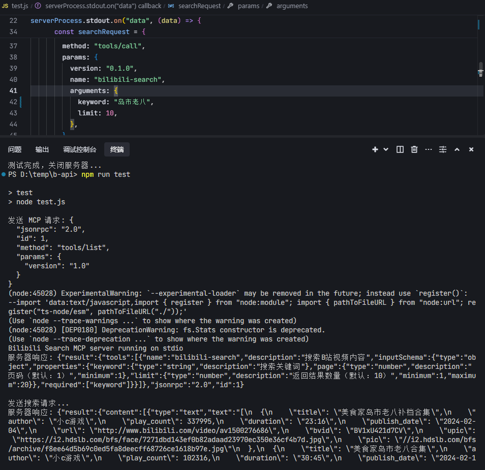

# Bilibili MCP

[](README-en.md)
[](README.md)
[](README-ja.md)

## 概要
これは Model Context Protocol (MCP) に基づいた Bilibili 動画検索サーバーです。このサーバーはシンプルな API インターフェースを提供し、ユーザーが Bilibili の動画コンテンツを検索できるようにします。LangChain の使用例とテストスクリプトが含まれています。

## 謝辞
- LangChain のサンプルコードは [mcp-langchain-ts-client](https://github.com/isaacwasserman/mcp-langchain-ts-client)を参考にしています

## 特徴
- Bilibili動画コンテンツ概要リストの検索
- Bilibiliホットコンテンツの取得（総合ホット、必見、ランキング、音楽チャート）
- Bilibili動画詳細情報の取得（BV番号またはAV番号をサポート）
- UP主情報の取得（基本情報、フォロワー数、フォロー数など）
- 番組タイムライン（時間範囲内のアニメ放送情報）

## システム要件
- Node.js >= 20.12.0
## AIツール設定
Traeを例として


## npm package
[HQHC](https://github.com/HQHC)が公開したnpmパッケージに感謝
```json
{
  "mcpServers": {
    "bilibili-search": {
    "command": "npx",
    "args": ["bilibili-mcp-js"],
    "description": "Bilibili動画検索用MCPサービス。AIアプリケーションでBilibiliの動画コンテンツを検索できます。"
    }
  }
}
```

## ローカルコンパイル使用
>使用前にコンパイルが必要です。
まず npm run build を実行し、次にビルド後の dist フォルダのパスに変更してください。"args": ["d:\\your-path\\bilibili-mcp-js\\dist\\index.js"] 
```json
{
  "mcpServers": {
    "bilibili-search": {
      "command": "node",
      "args": ["d:\\your-path\\bilibili-mcp-js\\dist\\index.js"],
      "description": "Bilibili動画検索用MCPサービス。AIアプリケーションでBilibiliの動画コンテンツを検索できます。"
    }
  }
}
```

## クイックスタート
> LangChain の例を実行する場合は、まず LLM モデルを設定し、.\example.ts ファイルを修正してください。
```javascript
const llm = new ChatOpenAI({
  modelName: "gpt-4o-mini",
  temperature: 0,
  openAIApiKey: "your_api_key", // あなたのモデルの API キーに置き換えてください
  configuration: {
    baseURL: "https://www.api.com/v1", // あなたのモデルの API アドレスに置き換えてください
  },
});
```

bun:

```bash
# 依存関係をインストール
bun i
# stdio モード
bun index.ts
# streamable http モード
TRANSPORT=remote bun index.ts
TRANSPORT=remote PORT=8888 bun index.ts
# テストスクリプト
bun test.js
# MCP Inspector
bun run inspector
# LangChain の例を実行
bun build:bun
bun example.ts
```

npm:

```bash
# 依存関係をインストール
npm i
# stdio モード
npm run start
# streamable http モード
TRANSPORT=remote npm run start
TRANSPORT=remote PORT=8888 npm run start
# テストスクリプト
npm run test
# MCP Inspector
npm run inspector
# LangChain の例を実行
npm run build
node dist/example.js
```

## スクリーンショット



