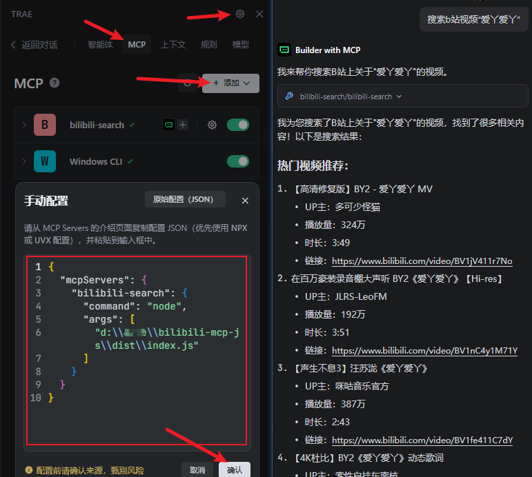
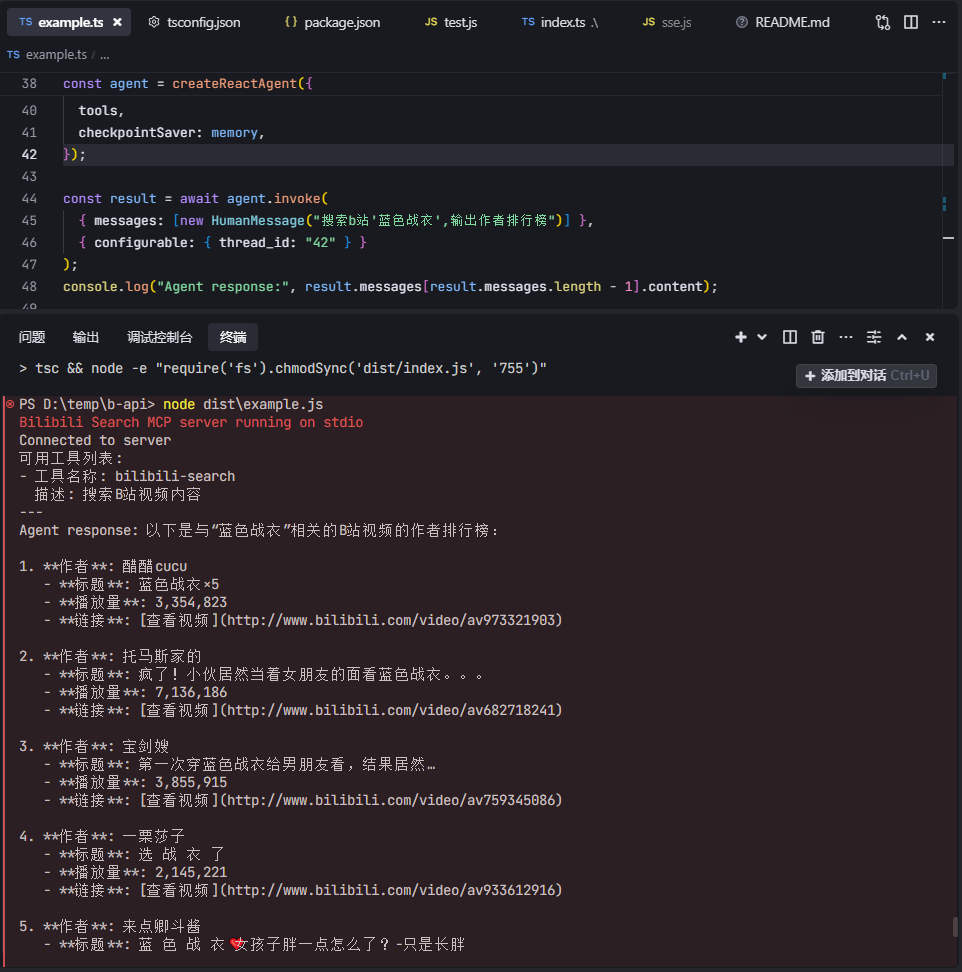

# Bilibili MCP

[](README-en.md)
[](README.md)
[](README-ja.md)

## 简介
这是一个基于 Model Context Protocol (MCP) 的 B站视频搜索服务器。该服务器提供了简单的 API 接口，允许用户搜索 B站 的视频内容。提供LangChain调用示例、测试脚本。

## 鸣谢
- LangChain 示例代码参考自 [mcp-langchain-ts-client](https://github.com/isaacwasserman/mcp-langchain-ts-client)

## 功能特点
- B站视频搜索
- 支持分页查询
- 返回视频信息（标题、作者、播放量、时长等）
- 基于 MCP 协议的标准化接口(支持 stdio 和 streamable http)

## 系统要求
- Node.js >= 20.12.0
## AI工具使用配置
以Trae为例


## npm package
感谢[HQHC](https://github.com/HQHC)发布的npm包
```json
{
  "mcpServers": {
    "bilibili-search": {
    "command": "npx",
    "args": ["bilibili-mcp"],
    "description": "B站视频搜索 MCP 服务，可以在AI应用中搜索B站视频内容。"
    }
  }
}
```
## 本地编译使用
>需要编译之后才可以使用.
先npm run build然后这里改成你build之后的dist文件夹路径，"args": ["d:\\your-path\\bilibili-mcp-js\\dist\\index.js"] 
```json
{
  "mcpServers": {
    "bilibili-search": {
      "command": "node",
      "args": ["d:\\your-path\\bilibili-mcp-js\\dist\\index.js"],
      "description": "B站视频搜索 MCP 服务，可以在AI应用中搜索B站视频内容。"
    }
  }
}
```

## 快速开始
> 如果要运行langchain例子，请先配置llm模型，修改.\example.ts文件。
```javascript
const llm = new ChatOpenAI({
  modelName: "gpt-4o-mini",
  temperature: 0,
  openAIApiKey: "your_api_key", // 替换成你模型的密钥
  configuration: {
    baseURL: "https://www.api.com/v1", // 替换成你模型的API地址
  },
});
```

bun:

```bash
# 安装依赖
bun i
# stdio 模式
bun index.ts
# streamable http 模式
TRANSPORT=remote bun index.ts
TRANSPORT=remote PORT=8888 bun index.ts
# 测试脚本
bun test.js
# MCP Inspector
bun run inspector
# 运行langchain例子
bun build:bun
bun example.ts
```

npm:

```bash
# 安装依赖
npm i
# stdio 模式
npm run start
# streamable http 模式
TRANSPORT=remote npm run start
TRANSPORT=remote PORT=8888 npm run start
# 测试脚本
npm run test
# MCP Inspector
npm run inspector
# 运行langchain例子
npm run build
node dist/example.js
```

## 截图



